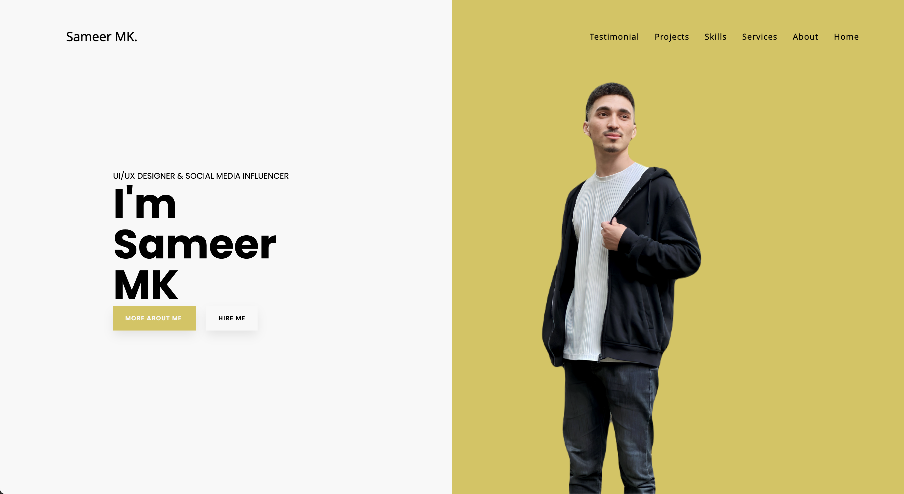

# Sameer MK's Portfolio

Welcome to my portfolio website! This was my first attempt at building a portfolio when I was learning HTML and CSS. The site showcases my projects and provides a glimpse into my skills and interests.

## Project Overview

The project is a static website built using only HTML and CSS. While it's not fully responsive at the moment, I plan to make it responsive in the future to ensure a better user experience across various devices.

## Features

- **About Me**: A brief introduction to Sameer MK, his background, and professional interests.
- **Skills**: A list of skills and technologies Sameer is proficient in.
- **Projects**: Showcase of Sameer's notable projects with details and links.
- **Resume**: Access to Sameer's resume for a more detailed overview.
- **Contact**: A contact form and links to Sameer's social media profiles for easy communication.

## Screenshots

## How to Use

1. Clone the repository: `git clone https://github.com/sameermuslim/Sameer-MK-portfolio.git`.
2. Open `index.html` in your web browser to view the portfolio locally.

## Contributing

If you have suggestions for improvements or find any issues, feel free to open an issue or submit a pull request. Contributions are always welcome!

## License

This portfolio project is licensed under the [MIT License](LICENSE). Feel free to use the code, modify it, and adapt it for your own portfolio.

Thank you for visiting Sameer MK's Portfolio!
